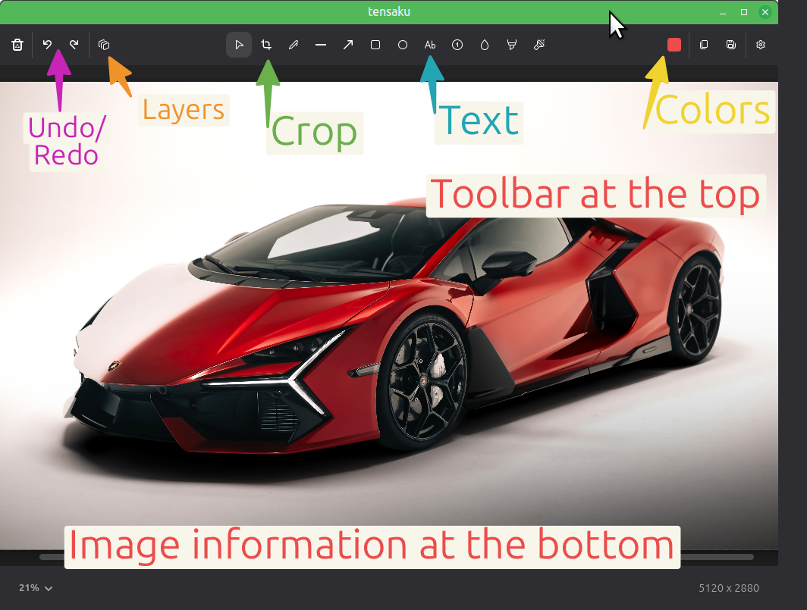
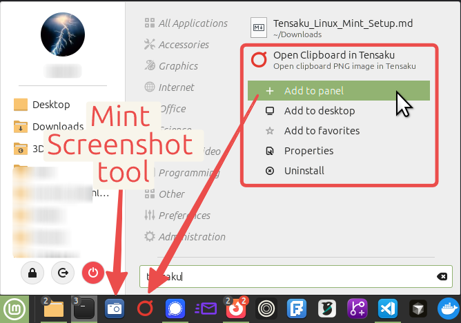
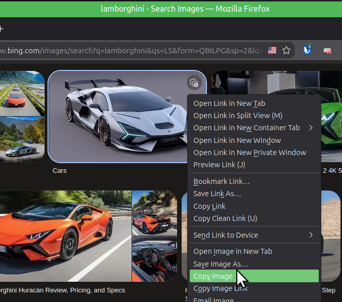
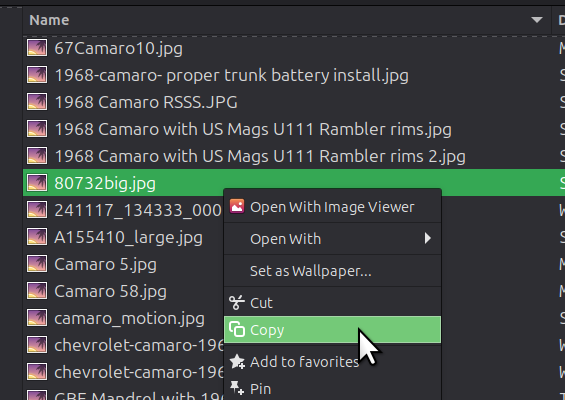
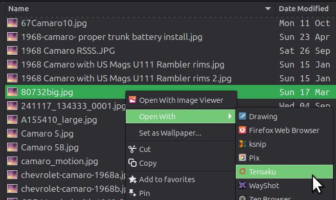

# Tensaku-Desktop on Linux X11 Desktops — Installation and Integration Notes

This project, Tensaku-Desktop, builds on the already excellent Tensaku app [jondkinney/tensaku](https://github.com/jondkinney/tensaku) by adding the Linux desktop glue needed for a faster, more natural clipboard-driven workflow.

## Environment

Tested on Linux Mint 22.3 with Cinnamon on X11. It should also work on other Linux desktops running X11, provided they support compatible clipboard handling, desktop launchers, and window-management tools such as `xclip` and `wmctrl`.

Tensaku is primarily designed for Wayland environments, especially wlroots-based compositors. This setup uses its X11 fallback and replaces the usual `grim`, `slurp`, and `wl-copy` workflow with Linux Mint’s screenshot tools, `xclip`, and `wmctrl`.



(figure 1. Tensaku Annotation Application. Toolbars at the top and Image information at the bottom.)

---

## Why Tensaku-Desktop

By default, the Tensaku app is launched from the command line. In this test setup, the installed bundle did not provide the clipboard-oriented launcher used here, so this repo adds one. It still requires an input image path passed through the `--filename` CLI parameter.

The `tensaku-clipboard.desktop` launcher file is registered with the Linux desktop, so it can be listed in the app menu and pinned to the bottom panel. It executes the `tensaku-clipboard` script, which bridges that UI gap by reading from the clipboard and launching Tensaku like a desktop app.

These notes document the Linux Mint X11 clipboard workflow used to make Tensaku a practical screenshot and general image-annotation tool, tested on Linux Mint 22.3.

The supporting files (`tensaku-clipboard.desktop`, `tensaku-clipboard`, and `config.toml`) are in the `src/` folder of this repository.

This repository also includes `src/install-fonts`, a helper that checks whether one or more font families are already available through `fontconfig` and installs missing families into `~/.local/share/fonts/tensaku`. It prefers built-in GitHub-backed font sources first, and only falls back to Google Fonts for other families.

### Expected behavior

See Section 6 below for workflows, but the script should:

- Accept native `image/png` clipboard data.
- Accept image-file references copied from Nemo (file explorer).
- Support PNG, JPG, JPEG, WebP, and BMP files.
- Stage files copied from SMB/GVFS paths into a local cache readable by the Flatpak.
- Exit gracefully when the clipboard does not contain a supported image.
- Detect the newly opened Tensaku window and resize each new window to `1024x768` (Tensaku's default size is small and `--resize` does not work under X11).
- Handle multiple Tensaku windows independently.
- Open a Tensaku window on whichever monitor the mouse cursor is currently located.


---

## 1. Install Tensaku

Download the standalone Flatpak bundle from the Tensaku GitHub Releases page:

- Project: [https://github.com/jondkinney/tensaku](https://github.com/jondkinney/tensaku)
- Expected bundle name: `tensaku.flatpak` under [Releases](https://github.com/jondkinney/tensaku/releases)

Install it for the current user:

```bash
cd ~/Downloads
flatpak install --user ./tensaku.flatpak
```

The installed Flatpak application ID is `dev.tensaku.Tensaku`.

---

## 2. Install Local Helper Packages

The clipboard wrapper uses `xclip` to read image data and `wmctrl` to detect and resize Tensaku windows. These may already be installed on Linux Mint.

```bash
sudo apt install xclip wmctrl
```

Tensaku is being used through its X11 fallback under the current Cinnamon session. Its normal Wayland-oriented tools such as `grim`, `slurp`, and `wl-copy` are not required for this workflow.

For the optional font installer helper, make sure `curl`, `fc-list`, `fc-cache`, and `python3` are available. `woff2_decompress` is also required when the selected font source provides `.woff2` files. `curl`, `python3`, and the fontconfig tools are usually already present on Linux Mint; install the WOFF2 converter with:

```bash
sudo apt install woff2
```

---

## 3. Confirm the Tensaku Environment

Run:

```bash
flatpak run dev.tensaku.Tensaku --doctor
```

Under Cinnamon/X11, expected warnings include:

- `WAYLAND_DISPLAY` missing
- `grim` missing
- `slurp` missing
- `wl-copy` missing

These warnings are acceptable for the clipboard-based X11 workflow.

---

## 4. Create the Clipboard Launcher Script

Create the local user binary directory:

```bash
mkdir -p ~/.local/bin
```

Create the launcher script:

```bash
nano ~/.local/bin/tensaku-clipboard
```

Paste the current working script here:

```bash
# SEE src/tensaku-clipboard IN THIS REPO
```

Make it executable:

```bash
chmod +x ~/.local/bin/tensaku-clipboard
```

Test it from a terminal:

```bash
~/.local/bin/tensaku-clipboard
```

The very first time you execute this from the CLI you will probably see this message:

```
EXIT: Clipboard does not contain an image or copied image file.
```

**This is normal.** 

When launched from the panel with no supported image in the clipboard, the script exits silently after writing the same message to standard error.

### Test Tensaku clipboard launcher now.

1. Use Ctrl+Shift+PrntScr keyboard combination to initiate the Linux Mint built-in screenshot tool.
2. Simply drag the mouse to grab a quick screenshot of anything on screen that then loads into clipboard memory.
3. Run the above bash command again `~/.local/bin/tensaku-clipboard` and you should see the Tensaku annotation window open with your captured desktop image.

This one test is one of many ways to open Tensaku with various clipboard images and image files. Keep reading to see more methods.

The cache directory used by the script is `~/.cache/tensaku`.

Temporary PNG files created from clipboard image data are deleted shortly after launch. Image files staged from Nemo or other file-manager references are retained in the cache and automatically removed when older than one day.

---

## 5. Create the Panel Launcher

Create a desktop entry:

```bash
mkdir -p ~/.local/share/applications
nano ~/.local/share/applications/tensaku-clipboard.desktop
```

Use:

```ini
[Desktop Entry]
Type=Application
Name=Open Clipboard in Tensaku
Comment=Open clipboard image in Tensaku
Exec=tensaku-clipboard
TryExec=tensaku-clipboard
Icon=dev.tensaku.Tensaku
Terminal=false
Categories=Graphics;
```

This command form avoids per-user path edits, but requires `tensaku-clipboard` to be available on the session `PATH` (for example via `~/.local/bin`). For public distribution, consider an installer that places the script and/or generates desktop entries automatically.

`TryExec=tensaku-clipboard` helps avoid a silent broken launcher by marking the entry unavailable if the command cannot be resolved.

Verify the command is on `PATH`:

```bash
command -v tensaku-clipboard
```

If this prints nothing, register `~/.local/bin` for your login session:

```bash
grep -qsF 'export PATH="$HOME/.local/bin:$PATH"' ~/.profile || echo 'export PATH="$HOME/.local/bin:$PATH"' >> ~/.profile
```

Then log out and log back in so Cinnamon/X11 picks up the updated session `PATH`.

Make it executable:

```bash
chmod +x ~/.local/share/applications/tensaku-clipboard.desktop
```

Find **Open Clipboard in Tensaku** in the Linux Mint application menu, right-click it, and select **Add to panel**.



(figure 2. Yes, I used Tensaku for the cropping and annotations in the image above. The screenshot was captured using the Linux Mint Screenshot tool with a 7 second delay allowing enough time to open the menu, search for Tensaku and right-click the launcher.)

This adds a one-click launcher to the taskbar panel, optionally alongside the Linux Mint Screenshot launcher.

---

## 6. Recommended Capture and Annotation Workflows

### Mint region capture

Use Linux Mint’s native region-selection keyboard shortcut:

`Ctrl+Shift+PrntScr`

Keyboard shortcut (single-window screenshot):

`Ctrl+Alt+PrntScr`

Keyboard shortcut (full desktop screenshot):

`Ctrl+PrntScr`

Then click the new Tensaku panel launcher to open the clipboard image for annotation.

---

### Mint Screenshot application

Keep the Linux Mint Screenshot application pinned to the panel for:

- Full-screen captures
- Window captures
- Region captures
- Delayed captures, such as a five-second delay

After capturing to the clipboard, click the Tensaku panel launcher.

---

### Web browser or various image review/edit applications

Right-click to copy any image from a web browser, image viewer, image editor, or another application exposing a visible image to the clipboard, then click the Tensaku panel launcher.



(figure 3.)

---

### Nemo copied image file

In Nemo:

1. Right-click an image file.
2. Select **Copy**.
3. Click the Tensaku panel launcher.

The wrapper stages SMB/GVFS files locally when required so the Flatpak can read them.



(figure 4.)

---

### Nemo Open With

In Nemo:

1. Right-click an image file.
2. Select **Open With --> Tensaku**.

Supported formats tested successfully include PNG, JPG, JPEG, WebP, and BMP.

This path launches Tensaku directly and bypasses the clipboard wrapper, so it may use Tensaku’s smaller default window size.



(figure 5.)

---

## 7. Tensaku TOML Configuration File

Tensaku exposes many settings through its built-in UI Settings screen, but some options — including `copy-command` — are only available via the TOML configuration file. The settings documented here focus on those not covered by the UI; refer to the [Tensaku documentation](https://github.com/jondkinney/tensaku) for the full list. The `src/config.toml` in this repository contains the example file.

The Flatpak-specific TOML configuration path is:

`~/.var/app/dev.tensaku.Tensaku/config/tensaku/config.toml`

Create the directory and file:

```bash
mkdir -p ~/.var/app/dev.tensaku.Tensaku/config/tensaku
nano ~/.var/app/dev.tensaku.Tensaku/config/tensaku/config.toml
```

Starter TOML Config file may look like this:

```toml
[general]
initial-tool = "pointer"
copy-command = "xclip -selection clipboard -t image/png -i"
actions-on-enter = ["save-to-clipboard"]
auto-copy = true
corner-roundness = 6
primary-highlighter = "block"

[font]
family = "Ubuntu"
#style = "Bold"
```

Notes:
- `pointer` is the initial annotation tool. (see documentation for all options)
- `copy-command` uses X11 `xclip` rather than Wayland `wl-copy`. This is recommended at a minimum on Linux Mint 22.3 and earlier, for the X11 environment.
- `auto-copy = true` updates the clipboard after annotation changes.
- Rectangle corner roundness is reduced from the default `12` to `6`.
- The `block` highlighter is the primary highlighter. `block` keeps the highlight straight and horizontal.
- `style = "Bold"` is disabled, enable at your discretion.

TOML comments begin with `#`:

```toml
# Full-line comment
font-family = "Noto Sans" # Inline comment
```

TOML does not support block comments.

---

## 8. Font Exploration

Useful neutral font families to test:

```text
Noto Sans
DejaVu Sans
Liberation Sans
Ubuntu
Cantarell
Inter
```

List installed font families:

```bash
fc-list : family | sort -u | less
```

A filtered list can be generated with:

```bash
fc-list : family |
  cut -d: -f2 |
  tr ',' '\n' |
  sed 's/^ *//' |
  sort -u |
  grep -Ei 'Noto Sans|DejaVu Sans|Liberation Sans|Ubuntu|Cantarell|Inter'
```

## 8.1 Installing Fonts

The repo includes `src/install-fonts`, which installs missing font families for the current user without `sudo`. The script requires `woff2_decompress` (`sudo apt install woff2`) only when the selected source provides `.woff2` files, such as the built-in Excalidraw aliases; fonts provided as `.ttf` files do not need it.

Source priority is:

1. Built-in GitHub-backed aliases such as `Excalifont` and `Virgil`
2. Google Fonts as a last-resort fallback for other families

If you run it with no arguments, it reads the font family from `src/config.toml`:

```bash
./src/install-fonts
```

You can also pass one or more families directly:

```bash
./src/install-fonts Ubuntu "Atkinson Hyperlegible"
```

Excalidraw-related names are supported directly:

```bash
./src/install-fonts Excalifont
./src/install-fonts Virgil
```

`Excalifont` is the better default if you want the current Excalidraw-style handwritten look. `Virgil` is still installable, but Excalidraw now treats it as an older font.

`Excalifont` is explicitly OFL-licensed in the Excalidraw repository. `Virgil` is bundled upstream and supported by the script, but this README does not make a stronger license claim for it.

Or use a comma-separated list:

```bash
./src/install-fonts "Ubuntu, Excalifont"
```

Use a dry run if you only want to see what it would install:

```bash
./src/install-fonts --dry-run
```

Installed fonts are written under `~/.local/share/fonts/tensaku`, then refreshed with `fc-cache -f`.

---

## 9. Useful Tensaku Commands

Open an image file:

```bash
flatpak run dev.tensaku.Tensaku --filename "/path/to/image.png"
```

Read PNG data from standard input (clipboard):

```bash
xclip -selection clipboard -t image/png -o |
  flatpak run dev.tensaku.Tensaku --filename -
```

Show Tensaku version:

```bash
flatpak run dev.tensaku.Tensaku --version
```

Show command-line help:

```bash
flatpak run dev.tensaku.Tensaku --help
```

Show environment diagnostics:

```bash
flatpak run dev.tensaku.Tensaku --doctor
```

Reset the image zoom to 100% while Tensaku is open:

`Ctrl+0`

Fit the image to the window:

`Ctrl+1`

---

## 10. Known Behaviors and Limitations

### Wayland support

Tensaku is designed primarily around Wayland tools such as `grim`, `slurp`, and `wl-copy`, especially on wlroots-based compositors.

The current Linux Mint workflow instead uses Cinnamon/X11, Linux Mint’s native screenshot tools, `xclip`, `wmctrl`, and Tensaku’s Flatpak X11 fallback.
### Upcoming Wayland support in Cinnamon

As of mid-2026, the Linux Mint team reports that Wayland support in Cinnamon is no longer experimental and is expected to be fully supported alongside X11 in the next release (planned for late 2026). When Wayland becomes the default session, this workflow will need to be updated:

- `xclip` would be replaced by a Wayland-native clipboard tool such as `wl-paste`.
- `wmctrl` does not work under Wayland; window resizing would require an alternative approach (hopefully `--resize` and defaults will work at that time).
- The Tensaku `copy-command` in `config.toml` would need to switch from `xclip` to `wl-copy`.

---

### Default window size

Tensaku’s own `--resize 1024x768` option was accepted but ignored under the current Cinnamon/X11 setup.

The wrapper therefore uses `wmctrl` to resize newly opened windows.

### 1080p vs 4K resolutions

The `1024x768` window size was chosen for 1080p displays. Users on 4K or other higher resolution displays may prefer a larger size and can update the value in `tensaku-clipboard` — search for `1024x768` and replace both occurrences with the desired dimensions.

### Startup resizing (window flash quirk)

File-based images may trigger a late internal Tensaku resize after loading. The wrapper waits for file-based window geometry to stabilize before applying the final `1024x768` window size.

Experience may include: a quick flash of Tensaku opening to a larger window, immediately resizing to a small window (observed `--resize` limitation under Cinnamon/X11), then the script resizing to the `1024x768` window size. Two to three resize changes in about one to two seconds may be noticeable.

Native Mint screenshot clipboard data does not need this delay and the window will open immediately. The user will only see one window and size open.

### Open With Tensaku

Nemo’s **Open With Tensaku** launches the original Flatpak desktop entry and bypasses the script wrapper. It therefore retains Tensaku’s default smaller window size. This is where the TOML configuration file (referenced above) may be helpful in the future.

A separate filename wrapper and custom desktop entry could fix this, but it was intentionally left alone because the added maintenance was not worth the benefit. (the juice wasn't worth the squeeze)

### Initial image zoom policy

The preferred behavior would be:

```text
If the image fits inside the available canvas at 100%:
    open at 100%
else:
    fit to the window
```

Tensaku does not currently expose this as a setting.

---

## 11. Updating Tensaku

Tensaku is installed from a local Flatpak bundle and does not update automatically. To update:

1. Watch for new releases on GitHub: go to the [Tensaku repository](https://github.com/jondkinney/tensaku), click **Watch → Custom → Releases** to receive a notification when a new bundle is published.
2. Download the new `tensaku.flatpak` bundle from the [Releases](https://github.com/jondkinney/tensaku/releases) page.
3. Reinstall over the existing version:

```bash
cd ~/Downloads
flatpak install --user ./tensaku.flatpak
```

Flatpak will detect the existing installation and upgrade it in place.

---

## 12. Current Practical Setup

```text
Linux Mint Screenshot / Ctrl+Shift+PrntScr
                    ↓
              Clipboard image
                    ↓
      Tensaku panel launcher script runs
                    ↓
       Tensaku annotation window opens
```

It also supports:

```text
Browser/app image copy
Nemo copy local image
Nemo copy SMB/GVFS image
Nemo Open With Tensaku
Direct image file launch
```

This leaves Linux Mint responsible for capture and Tensaku responsible for annotation, while also making Tensaku a general-purpose annotation target for images from many sources.

&nbsp;

---
